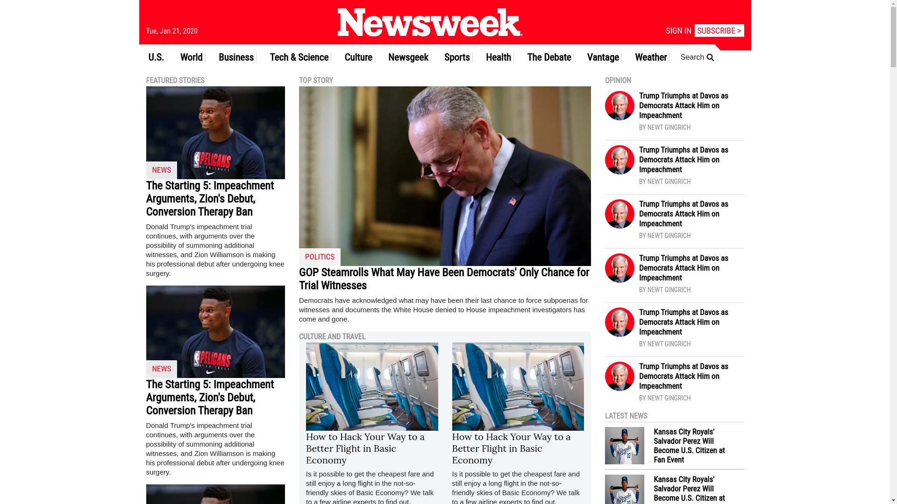

# Project: Using Bootstrap.

> This project is part of the Microverse Technical Skills Curriculum, it's the second solo project I've finished. The main purpose of the project is to familiarize the developer with the Bootstrap framework, with a strong emphasis on Bootstrap Grid layout.

The assignment for the project was to build a clone of [Newsweek](https://www.newsweek.com/). 
The site has a farily complex layout, which is great to get good practice with a layout framework such as Bootstrap grid. I've really enjoyed building the site, and it has definitely given me a good grasp on how to build a layout using Bootstrap.

## Built With

- HTML
- CSS3
- Bootstrap

## Live Demo

[Live Demo Link](https://raw.githack.com/ivanid22/microverse-using-bootstrap-project/development-branch/index.html)

## Author

👤 **Ivan Diaz**

- Github: [@ivanid22](https://github.com/ivanid22)

## Show your support

Give a ⭐️ if you like this project!